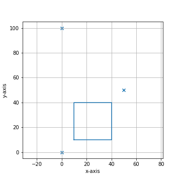

*******************
Quick Start
*******************

Installation from Github
========================

To install the py-lmd library clone the Github repository and use pip to install the library in your current environment. It is recommended to use the library with a conda environment. 
::

  git clone https://github.com/HornungLab/py-lmd
  pip install py-lmd
  
Once installed the modules can be loaded as following:

.. code-block:: python

    from lmd.lib import Collection, Shape

Generating Shapes
=================
As first example we will create a cutting data for a rectangle and visualize it. First we need to think of a calibration points for our coordinate system.  The calibration points are specified as numpy array and should have the shape `(3, 2)`. When calibrating the file on the Leica LMD after loading the file, the order of selecting the calibration points is the same as the order of points set here. If no other orientation transform has been specified,  the calibration points are defined in the `(x, y)` coordinate system. More on the usage of different coordinate systems can be found under XXX.

.. code-block:: python

    import numpy as np
    from lmd.lib import Collection, Shape
    
    calibration = np.array([[0, 0], 
                            [0, 100], 
                            [50, 50]])
    
With these calibration coordinates we can create our :py:class:`~lmd.lib.Collection` object. The :py:class:`~lmd.lib.Collection` is the base object for creating cutting data and holds a list of :py:class:`~lmd.lib.Shape` objects. Furthermore, it allows to read and write the Leica LMD XML format and handles the coordinate system.

.. code-block:: python

    my_first_collection = Collection(calibration_points = calibration)
    
We can then create our first rectangle by using the :py:class:`~lmd.lib.Shape` object and passing it to our collection by using the :py:class:`~lmd.lib.Collection.add_shape` method. For creating the Shape object we need to pass the vertices as numpy array. List of vertices should always be closed with the last vertex equaling the first one.

.. code-block:: python

    rectangle_coordinates = np.array([[10,10], 
                                      [40,10], 
                                      [40,40], 
                                      [10,40], 
                                      [10,10]])
    rectangle = Shape(rectangle_coordinates)
    my_first_collection.add_shape(rectangle)
    
We can visualize our collection with the :py:class:`~lmd.lib.Collection.plot` method. Using the `calibration = True` parameter will include the calibration coordinates in the plot.

.. code-block:: python

    my_first_collection.plot(calibration = True)

We can generate a second shape in form of a triangle. This time we will be using the :py:class:`~lmd.lib.Collection.new_shape` method of the collection object. 

.. code-block:: python

    triangle_coordinates = np.array([[10,70], [40,70], [40,100], [10,70]])
    my_first_collection.new_shape(triangle_coordinates)
    
    my_first_collection.plot(calibration = True)
    
.. image:: images/fig2.png
   :scale: 100%
   
We can then export and save our collection of shapes into xml cutting data. 

.. code-block:: python

    my_first_collection.save("first_collection.xml")

.. code-block:: xml

    <?xml version='1.0' encoding='UTF-8'?>
    <ImageData>
      <GlobalCoordinates>1</GlobalCoordinates>
      <X_CalibrationPoint_1>0</X_CalibrationPoint_1>
      <Y_CalibrationPoint_1>0</Y_CalibrationPoint_1>
      <X_CalibrationPoint_2>0</X_CalibrationPoint_2>
      <Y_CalibrationPoint_2>10000</Y_CalibrationPoint_2>
      <X_CalibrationPoint_3>5000</X_CalibrationPoint_3>
      <Y_CalibrationPoint_3>5000</Y_CalibrationPoint_3>
      <ShapeCount>2</ShapeCount>
      <Shape_1>
        <PointCount>5</PointCount>
        <X_1>1000</X_1>
        <Y_1>1000</Y_1>
        <X_2>4000</X_2>
        <Y_2>1000</Y_2>
        <X_3>4000</X_3>
        <Y_3>4000</Y_3>
        <X_4>1000</X_4>
        <Y_4>4000</Y_4>
        <X_5>1000</X_5>
        <Y_5>1000</Y_5>
      </Shape_1>
      <Shape_2>
        <PointCount>4</PointCount>
        <X_1>1000</X_1>
        <Y_1>7000</Y_1>
        <X_2>4000</X_2>
        <Y_2>7000</Y_2>
        <X_3>4000</X_3>
        <Y_3>10000</Y_3>
        <X_4>1000</X_4>
        <Y_4>7000</Y_4>
      </Shape_2>
    </ImageData>
    
Looking at the generated xml output we can see the calibration points and different shapes. Furthermore, we see that the coordinate system has been scaled by a linear scaling factor. As all points are defined as integers scaling by a linear factor allows to use decimal numbers as coordinates.
    
Creating digits 
=================