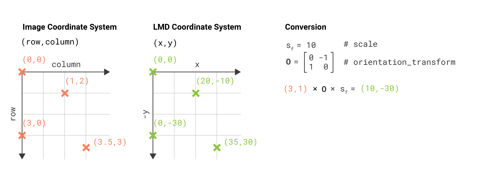
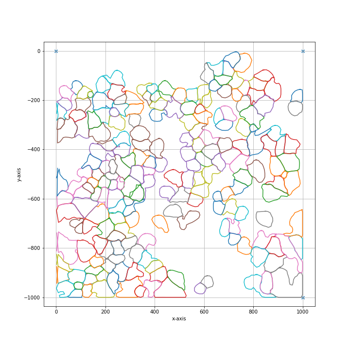

***********************
Using Segmented Images
***********************

Background
========================

.. image:: images/watershed.png
    :width: 400px
    :height: 400px
    :scale: 100 %
    :align: right

Although the py-lmd package is meant to serve as framework for creating your own workflows, generating cutting data based on segmentations is the central application of this package.
When biological images are segmented, every pixel receives a class or label. Labels can be used to identify single cells and distinguish them from the background or can categorize
cells or areas based on phenotypes, functions or location. 

In the following example we will assume that a segmentation was performed to assign labels to individual cells and distinguish their cytosol from the background. 
The procedures are though applicable to all types of labels.

As this process is so central to the usage of the Leica LMD, the :py:class:`~lmd.lib.SegmentationLoader` can be used to create cutting data based on segmentation data.
The workflow was specifically designed to work with whole slide images, as large as the LMD membrane slides, and large numbers of single cells. 
Therefore, different processing steps are included which optimize single cell shapes and decrease overall cutting time.  

Different Coordinate Systems
=============================
Using images to generate cutting data with the py-lmd package makes it necessary to transform the image coordinate system to the Leica LMD coordinate system. Although this functionality is part of the package, it is important to highlight the differences in the coordinate systems and to keep in mind what coordinate system is used when calibration points are determined from image data.

The coordinates for the Leica LMD are defined as `(x, y)` coordinates with the x-axis extending to the right and the y-axis extending to the top. All cutting data should exist in this coordinate system and should be calibrated accordingly. When cutting data is generated based on whole slide images we have to keep in mind that images are often indexed differently. Images in Fiji or Numpy are indexed as `(row, column)` with the rows extending downwards and the columns extending to the right. If we want to identify positions in image data - like calibration crosses or single cells - we have to translate their position in the `(row, column)` format to the `(x, y)` format. 

  
The py-lmd library has been designed in a way which allows to transform the coordinate system prior to saving. Therefore one can specify all coordinates in the image coordinate system and rely on the library to handle the transformation. In this case the `orientation_transform` attribute needs to be set when the Collection is created.

.. code-block:: python

    calibration = np.array([[10, 10], [1000, 10], [500, 500]])

    collection = Collection(calibration_points = calibration)
    collection.orientation_transform = np.array([[0, -1], [1, 0]])
    
In this case  all coordinates for calibration points and shapes can be set in form of `(row, column)` coordinates. The orientation transform is only applied when the Collection is saved or, if desired, when the Collection is plotted.

Getting started with the SegmentationLoader
================================================

Before we can start with the :py:class:`~lmd.lib.SegmentationLoader`, we have to load our image which contains the labels for our cells. The segmentation loader expects a numpy array of integers where the background is assigned to label 0. There are no further restrictions to the shape or number of labels other than being continuos. All pixel with a certain label need to be in contact with each other. Functional labels which assign cells based on the cell type must be converted.

As example we will use the cytosol segmentation seen above which can be found under `notebooks/Image_Segmentation/segmentation_cytosol.tiff`. First, we will load this image and convert it to a numpy array. 

.. code-block:: python

    import numpy as np
    from PIL import Image

    im = Image.open('segmentation_cytosol.tiff')
    segmentation = np.array(im).astype(np.uint32)

Based on this segmentation we have to select group of cells. These groups can be assigned to separate wells and intersecting shapes and cutting paths will be optimized separately for every group. In our case, all cells will be selected and assigned to the same well A1. 

.. code-block:: python

    all_classes = np.unique(segmentation)
    cell_sets = [{"classes": all_classes, "well": "A1"}]

Next we need to specify the calibration points which were identified in the image and the coordinate transform which should be applied. By default, the :py:class:`~lmd.lib.SegmentationLoader` will read all coordinates as `(row, column)` based on the top left origin. Therefore, the calibration points should be specified in the same way. 

.. code-block:: python

    calibration_points = np.array([[0,0],[0,1000],[1000,1000]])

    loader_config = {
        'orientation_transform': np.array([[0, -1],[1, 0]])
    }

We can now create an instance of the :py:class:`~lmd.lib.SegmentationLoader` and generate the cutting data. 

.. code-block:: python

    from lmd.lib import SegmentationLoader
    sl = SegmentationLoader(config = loader_config)
    shape_collection = sl(segmentation, 
                        cell_sets, 
                        calibration_points)
                        
    shape_collection.plot(fig_size = (10, 10))

Overview of Configuration
==========================

.. list-table:: Overview of Configuration Parameters.
    :widths: 10 5 25
    :header-rows: 1
    :stub-columns: 1

    * - Parameter
      - Default Value
      - Description
    * - ``shape_dilation``
      - ``0``
      - dilation of the cutting mask in pixel before intersecting shapes in a selection group are merged
    * - ``shape_erosion``
      - ``0``
      - erosion of the cutting mask in pixel before intersecting shapes in a selection group are merged
    * - ``binary_smoothing``
      - ``3``
      - Cutting masks are transformed by binary dilation and erosion
    * - ``convolution_smoothing``
      - ``15``
      - number of datapoints which are averaged for smoothing. The resolution of datapoints is twice as high as the resolution of pixels.
    * - ``poly_compression_factor``
      - ``30``
      - fold reduction of datapoints for compression
    * - ``path_optimization``
      - ``"hilbert"``
      - Optimization of the cutting path inbetween shapes. Optimized paths improve the cutting time and the microscopes focus. valid options are ``["none", "hilbert", "greedy"]``
    * - ``hilbert_p``
      - ``7``
      - Paramter required for hilbert curve based path optimization. Defines the order of the hilbert curve used, which needs to be tuned with the total cutting area.
    * - ``greedy_k``
      - ``20``
      - Parameter required for greedy path optimization. Instead of a global distance matrix, the k nearest neighbours are approximated. The optimization problem is then greedily solved for the known set of nearest neighbours until the first set of neighbours is exhausted.Established edges are then removed and the nearest neighbour approximation is recursivly repeated.
    * - ``distance_heuristic``
      - ``300``
      - Overlapping shapes are merged based on a nearest neighbour heuristic. All selected shapes closer than distance_heuristic pixel are checked for overlap.

Processing Order
==========================

.. list-table:: Processing Order
  :widths: 10 

  * - Binary dilation of cell masks
  * - Binary erosion of cell masks
  * - **If activated** join intersecting shapes
  * - Binary smoothing of joined cell masks
  * - Filling holes of joined cell masks
  * - Smoothing by convolution
  * - Compress polygons
  * - Optimize global cut path

+---------------------------------------------------------------------------------------------+
| **binary_smoothing**                                                                        |
+=============================================================================================+
| Binary smoothing by applying a binary dilation followed by a erosion of the same size.      |
| Binary smoothing can extend above the convex hull and therefore lead to intersection with   |
| other shapes. ``binary_smoothing`` does not change the number                               |
| of vertices in the polygon of a shape. Please see ``poly_compression_factor``.              |
+-----------------------------+-------------------------------+-------------------------------+
|``binary_smoothing: 0``      | ``binary_smoothing: 15``      | ``binary_smoothing: 30``      |
+-----------------------------+-------------------------------+-------------------------------+
| .. image:: images/bin0.png  | .. image:: images/bin15.png   | .. image:: images/bin30.png   |
+-----------------------------+-------------------------------+-------------------------------+

+---------------------------------------------------------------------------------------------+
| **convolution_smoothing**                                                                   |
+=============================================================================================+
| Smooth the polygon by applying a circular, linear convolution of given size.                |
| The default convolution kernel with ``n`` elements is ``[1/n, 1/n, ... , 1/n]``.            |
| By default a value of 15 is used. Values below 3 are not recommended.                       |
| In contrast to ``binary_smoothing``, ``convolution_smoothing`` does not increase            | 
| the convex hull of the shape. When there are many deep recessions in the shape              | 
| ``convolution_smoothing`` might not be able to smooth these out and                         |
| ``binary_smoothing`` should be used. ``convolution_smoothing`` does not change the number   |
| of vertices in the polygon of a shape. Please see ``poly_compression_factor``.              |
+-----------------------------+-------------------------------+-------------------------------+
|``convolution_smoothing: 1`` | ``convolution_smoothing: 40`` | ``convolution_smoothing: 80`` |
+-----------------------------+-------------------------------+-------------------------------+
| .. image:: images/conv1.png | .. image:: images/conv40.png  | .. image:: images/conv80.png  |
+-----------------------------+-------------------------------+-------------------------------+

+------------------------------------------------------------------------------------------------------------+
| **poly_compression_factor**                                                                                |
+============================================================================================================+
| Compress the number of vertices by a given factor.                                                         |
+-----------------------------------+-----------------------------------+------------------------------------+
|``poly_compression_factor: 1``     | ``poly_compression_factor: 20``   | ``poly_compression_factor: 40``    |
+-----------------------------------+-----------------------------------+------------------------------------+
| .. image:: images/comp1.png       | .. image:: images/comp20.png      | .. image:: images/comp40.png       |
+-----------------------------------+-----------------------------------+------------------------------------+
| .. image:: images/comp_dots1.png  | .. image:: images/comp_dots20.png | .. image:: images/comp_dots40.png  |
+-----------------------------------+-----------------------------------+------------------------------------+
| .. code-block::                   | .. code-block::                   | .. code-block::                    |
|                                   |                                   |                                    | 
|   ===== Collection Stats =====    |   ===== Collection Stats =====    |   ===== Collection Stats =====     |
|   Number of shapes: 7             |   Number of shapes: 7             |   Number of shapes: 7              |
|   Number of vertices: 4,913       |   Number of vertices: 245         |   Number of vertices: 123          |
|   ============================    |   ============================    |   ============================     |
|   Mean vertices: 702              |   Mean vertices: 35               |   Mean vertices: 18                |
|   Min vertices: 599               |   Min vertices: 30                |   Min vertices: 15                 |
|   5% percentile vertices: 617     |   5% percentile vertices: 31      |   5% percentile vertices: 15       |
|   Median vertices: 687            |   Median vertices: 34             |   Median vertices: 17              |
|   95% percentile vertices: 811    |   95% percentile vertices: 40     |   95% percentile vertices: 20      |
|   Max vertices: 839               |   Max vertices: 42                |   Max vertices: 21                 |      
+-----------------------------------+-----------------------------------+------------------------------------+
